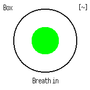

# BreathTimer

A tiny app helping you to breath and relax.

It supports multiple breathing patterns (Box breathing, 4-2-4, 4-7-8), and Vibrations each time it changes from breathing to holding. 

Pattern can be changed by swiping up and down. To enable the vibration, tap the top right till `[~]` appears. Last used settings are automatically saved.

Update by [JakobPer](https://github.com/jakobper)

Based on Henkinen by Jukio Kallio

 
